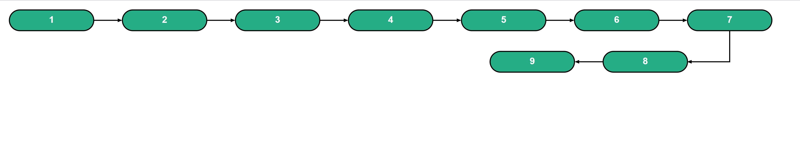

# LinearFlowchart

This library was generated with [Angular CLI](https://github.com/angular/angular-cli) version 12.1.0.

# Properties
## cellsOnFirstLine:
    To define the number of cells to be shown on the first row in flowchart. 
    Type : number
    Example : [cellsOnFirstLine]="4"

## FontFamily:
    To define the Font family of the text.
    Type : String
    Example : [FontFamily]="'sans-serif'"

## CellColor:
    To define color of the cells.
    Type : String
    Example : [CellColor]="'green'"

## Data:
    To put your desired text in cells, send the data in array form.
    Type : Array

## svgWindowHeight:
    To define the SVG height. Default set to 400px
    Type : Number
    Example : [svgWindowHeight]="400"

## RouteData:
    To Route on click on cells, send the data in array form.
    Note: length of Data array and RouteData array must be equal
    Type : Array
